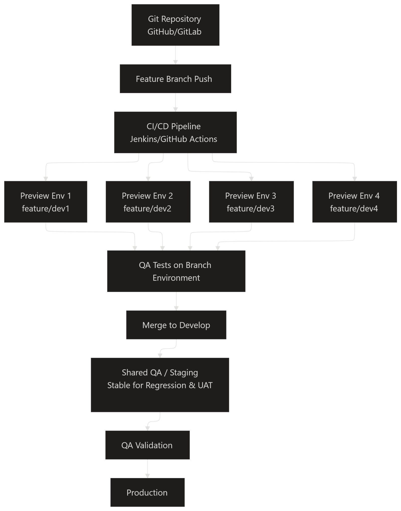

# DevOps Environment Scaling Solution

## Overview

This project demonstrates a scalable DevOps workflow designed to solve deployment conflicts caused by using a single shared staging environment for multiple developers.

The architecture introduces isolated feature environments, automated CI/CD pipelines, and a stable QA/staging workflow to improve deployment reliability and testing efficiency.

---

# Problem Statement

Current setup:
- 4 Developers
- 1 QA
- Single shared staging environment

### Existing Issue

When one developer deploys code to the staging environment, it overwrites or impacts another developer’s deployment currently under QA testing.

This creates:
- Deployment conflicts
- Unstable QA testing
- Broken feature validation
- Delayed releases
- Difficult rollback management

---

# Proposed Solution

The solution introduces:

- Feature branch based isolated environments
- Automated CI/CD pipelines
- Independent QA testing environments
- Shared stable staging for regression testing
- Controlled promotion to production

Each developer works in an isolated environment without affecting other developers or QA activities.

---

# Architecture Diagram

---

# Workflow Explanation

## 1. Feature Branch Development

Each developer works on an individual feature branch.

Example:
- feature/dev1
- feature/dev2
- feature/dev3

---

## 2. CI/CD Pipeline Trigger

When code is pushed to a feature branch:
- CI/CD pipeline automatically starts
- Build and deployment process begins

Tools:
- GitHub Actions / Jenkins
- Docker
- Kubernetes

---

## 3. Isolated Feature Environments

The pipeline creates dedicated preview environments for each branch.

Examples:
- Preview Env 1 → feature/dev1
- Preview Env 2 → feature/dev2

This prevents deployment conflicts between developers.

---

## 4. QA Testing

QA validates features independently inside branch-specific environments before merge approval.

This ensures:
- Stable testing
- Independent validation
- Faster issue identification

---

## 5. Merge to Develop

After successful QA validation:
- Code is merged into the develop branch
- Shared QA/Staging environment is updated

This environment is used for:
- Regression testing
- Integration testing
- UAT validation

---

## 6. Production Deployment

Once final QA validation is completed:
- Application is promoted to production

---

# Benefits

- Eliminates staging environment conflicts
- Supports parallel development
- Improves QA efficiency
- Enables scalable deployments
- Reduces deployment failures
- Improves release reliability

---

# Technologies Used

- GitHub
- GitHub Actions
- Docker
- Kubernetes
- Terraform
- AWS
- Jenkins
- Linux

---

# Future Improvements

- Auto destroy feature environments after merge
- Add monitoring using Prometheus & Grafana
- Implement blue-green deployments
- Add automated smoke testing
- Add Helm-based Kubernetes deployments

 
